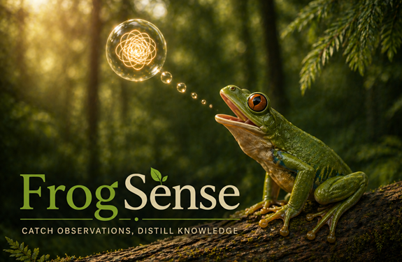
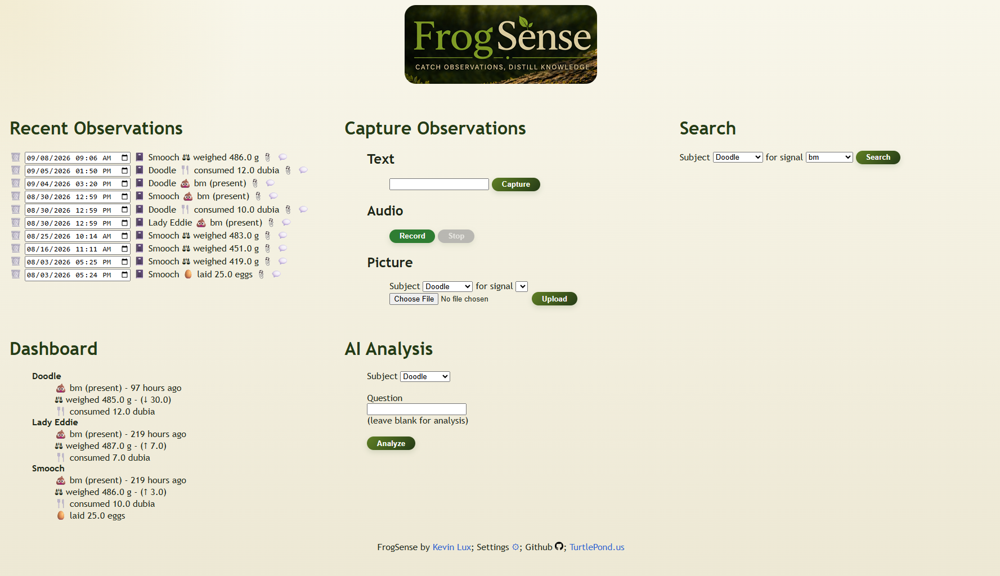

# FrogSense



A longitudinal observation system for capturing, structuring, and preserving observations over time. This part of the [Turtle Pond](https://turtlepond.us) suite.

---

## What it does

- Uses text/voice/image to collect observations.
- Extracts structured data from observations using configured signals and optional AI.
- Preserves the original evidence alongside structured observations.
- Uses optional AI for summarization and longitudinal analysis.

---

## Example output



---

## Current state

This is an early project.

- Designed to run locally
- Flask-based web interface
- Focused on simplicity over completeness

---

## Installation

### Using Docker Compose (COMING SOON and easiest)

Go to where you keep your Docker files, e.g. /opt

Create a folder for FrogSense., e.g. ```mkdir frogsense```

Go into the folder, e.g. ```cd frogsense```

Create a data folder, e.g. ```mkdir frogsense-data```

Create a docker-compose file, e.g. ```nano docker-compose.yml```

docker-compose.yml:
```
services:
  frogsense:
    image: ghcr.io/lux-k/frogsense:latest
    container_name: frogsense
    restart: unless-stopped
    ports:
      - "5000:4000"
    volumes:
      - /etc/localtime:/etc/localtime:ro
      - ./frogsense-data:/data:rw
```

Bring up the new container, e.g. ```docker compose up -d```

You should then be able to connect to the machine's IP on port 5000, e.g. http://192.168.100.10:5000.

### Building your own container

Go to where to want the code to live.

Grab the source code, e.g. ```git pull https://github.com/lux-k/frogsense.git```

Add this stanza to your docker-compose.yml:

```
  frogsense:
    container_name: frogsense
    restart: unless-stopped
    build:
      context: ./frogsense
      dockerfile: docker/dockerfile
    volumes:
      - /etc/localtime:/etc/localtime:ro
      - ./frogsense-data:/data:rw
    ports:
      - "5000:4000"
```

Build and run the container, e.g. ```docker compose up frogsense --build ```

You should then be able to connect to the machine's IP on port 5000, e.g. http://192.168.100.10:5000.

## venv / non-Docker setup

```bash
apt install git ffmpeg
cd /opt
python -m venv frogsense-env
source frogsense-env/bin/activate
git clone https://github.com/lux-k/frogsense
cd frogsense
pip install -r requirements.txt
python frogsense_web.py
```

You should then be able to connect to the machine's IP on port 4000, e.g. http://192.168.100.10:4000.

---

## Why

I wanted to be able to organize my notes around my animals and use AI to mine the data for trends that may not be visible to me immediately.

---

## Configuration

Setting up of subjects and signals is not strictly required, but does enable more useful analysis. I need to write instructions down for this.

---

## AI use

This system can use OpenAI for image analysis, summarization and questions on subjects. Details on configuring that are coming soon.

---

## Of note

I use FrogSense primarily for observations about animals and pets, but there is nothing animal-specific about its underlying model. A subject can be anything that benefits from observations over time — an animal, plant, pond, vehicle, house, HVAC system, or something else entirely.

FrogSense does not require every observation to be structured in advance. Original observations and evidence can be retained as-is, while useful information can be promoted into structured signals for validation and longitudinal analysis.

---

## License

(TBD)
